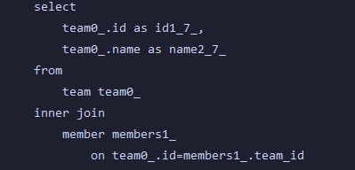

# @BatchSize 옵션

## TL;DR

@BatchSize, batch_fetch_size를 사용하기 위해선 `SELECT * FROM TEAM` 과 같이 조인, 페치를 사용하지 않아야 in query로 쿼리가 나가 BatchSize 옵션이 적용된다.

전역 적용

```yaml
spring:
  jpa:
    properties:
      hibernate:
        default_batch_fetch_size: 100
```

Field, Class 적용

_필드, 클래스 적용을 할 때에는 연관관계 일대다 일 경우 일쪽에서 (Field, Class) 적용한다._


또한 조회할 때에는 fetch를 사용하게 되면 in query가 나가지 않게 된다.

일반적인 join을 사용하게 될 경우엔 in query가 나가지만, 데이터 뻥튀기가 일어나서 같은 결과 값이 여러 개가 나온다.

## 일반 조회 - Batch Size 적용


## 조인 - Batch Size 적용




in query가 나가긴 하지만 결과 값을 보게 되면 데이터 뻥튀기가 일어난다.


## 페치 조인 - Batch Size 적용


페치 조인 답게 한 방 쿼리로 조회가 되지만 Batch Size는 적용 되지 않는다.

join을 했으므로 결과 값은 데이터 뻥튀기가 되어 나온다.

