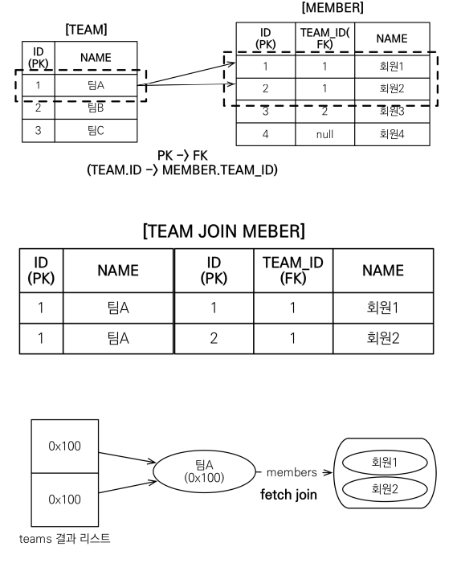
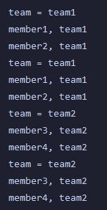
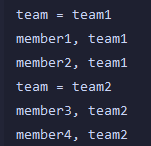

# 일대다 페치 조인

위와 같은 일대다 관계에서

Team이 1 : Member가 N

Team이 Member를 조회할 때 팀1에 속한 멤버가 두명이면.

Team1을 조회한 컬럼의 값은 위와 같이 두 줄로 반환된다

따라서 페치 조인을 했을 때 결과 값이 다음과 같이 나온다.

team1에 member가 두 명 있어서 member1 한 번, member2 한 번 조회하는 것이 아닌

member1 member2 한 묶음 두 번씩 나오게 된다.

위의 중복을 제거하기 위한 방법으로 `distinct` 키워드를 사용하는 방법도 있다.

*`distinct`*를 사용한 쿼리 결과

